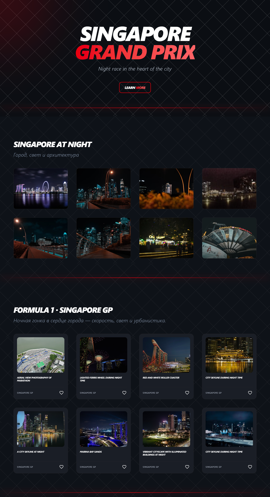

# 🏎️ Singapore Grand Prix Landing

Modern landing page inspired by Formula 1 Singapore Grand Prix  
Built with focus on neon aesthetics, animations and urban UI

[** Live Demo:**](https://marygeraska.github.io/singapore-f1)


 


##  Features

- Neon UI design
- Animated hero section
- Image gallery (Unsplash API)
- Responsive layout
- Dark theme

##  Tech stack

- **React (Hooks)**
- **Vite**
- **Tailwind CSS** 
- **Unsplash API**
- **Context API (theme)**
- **GitHub Pages (deployment)**

##  What I focused on

- Visual hierarchy
- UI consistency
- Smooth interactions
- Modern landing design

##  Setup


1. **Clone the repository:**
   ```bash
   git clone https://github.com/marygeraska/singapore-f1.git
   ```

2. **Go to the project folder:**
  ```bash
   cd singapore-f1 
   ```

3. **Install dependencies:**
   ```bash
   npm install
   ```
4. **Create .env and add new key**
   ```bash
   VITE_UNSPLASH_ACCESS_KEY=your_key_here
   ```
5. **Run the project:**
   ```bash
   npm run dev
   ```
## Note
   This project uses Unsplash API and is intended for educational purposes.

## 🇷🇺 Краткое описание

Лендинг, вдохновлённый гонкой Singapore Grand Prix (Formula 1).

Основные особенности:

неоновый UI и тёмная тема
анимированный hero-блок
галерея с изображениями (Unsplash API)
адаптивный дизайн
система тем

Проект демонстрирует навыки создания современных интерфейсов, работы с API и UI/UX дизайна.